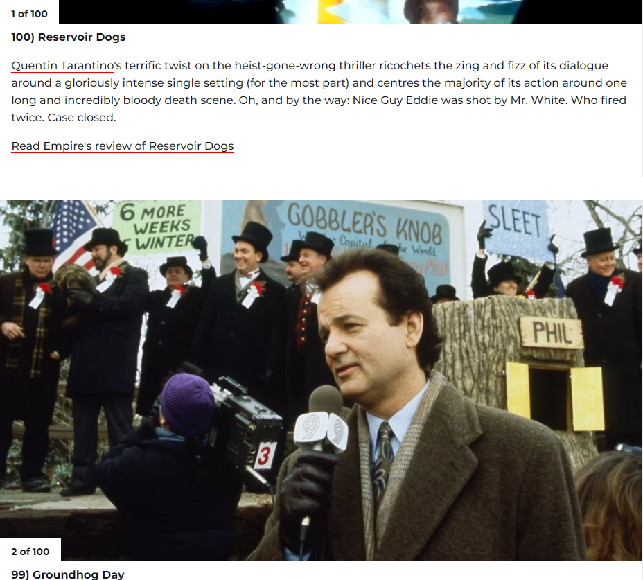
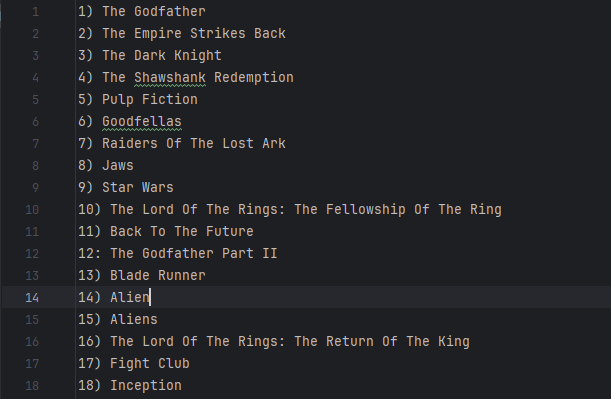

# 100 Movies

## Table of contents
* [General info](#general-info)
* [Technologies](#technologies)
* [Setup](#setup)

## General info
Scrapes the top 100 movies of all time from a website, and generates a text file called `movies.txt` that lists the movie titles in ascending order (starting from 1).

From the web:


Output txt file:

	
## Technologies
Project is created with:
* Python: 3.12
* Libraries: Beautiful Soup
	
## Setup
To run this project, find the local directory in terminal and use the python script_name.py command:
```
$ cd ../100Movies
$ python main.py
```