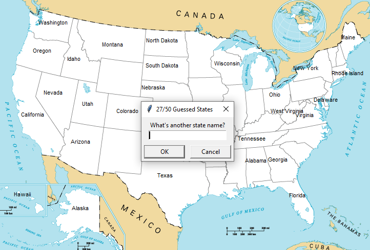

# 50 States

## Table of contents
* [General info](#general-info)
* [Technologies](#technologies)
* [Setup](#setup)

## General info
50 States is a game where users try to guess all 50 United States state names. If the input is correct and not yet guessed, the state name will appear on the map, and the number of guessed states increases by one. If a guess is incorrect, nothing happens, and the user may make another guess.


	
## Technologies
Project is created with:
* Python: 3.12
* Libraries: turtle
	
## Setup
To run this project, find the local directory in terminal and use the python script_name.py command:
```
$ cd ../50StatesGame
$ python main.py
```