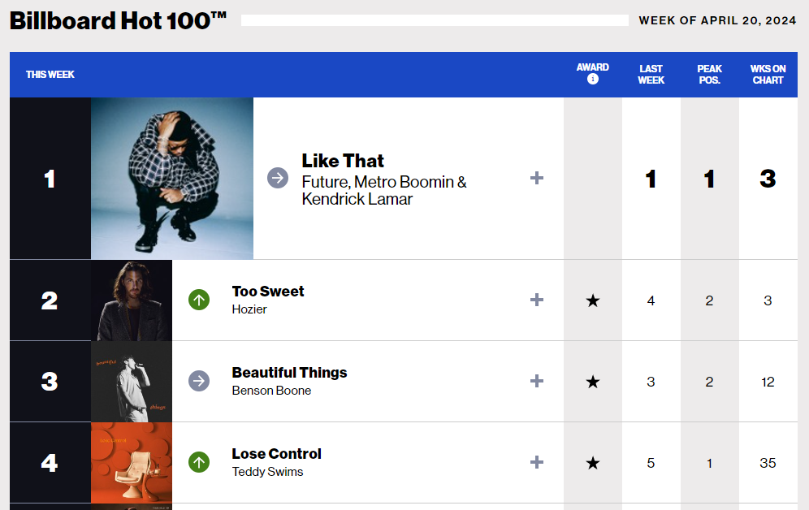
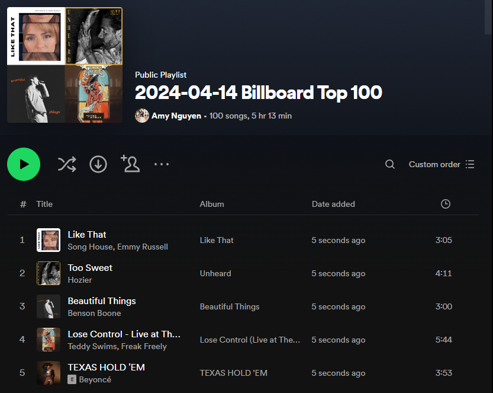

# Billboard 100

## Table of contents
* [General info](#general-info)
* [Technologies](#technologies)
* [Setup](#setup)

## General info
Asks user for a date. Scrapes Billboard Hot 100 songs of that week. Uses Spotify API to create playlist and find songs to add to playlist.

From the web:



Playlist created in Spotify (my wedding day!):



	
## Technologies
Project is created with:
* Python: 3.12
* Libraries: Requests, Spotify, Beautiful Soup
	
## Setup
To run this project, user must update the Client ID, Client Secret, and Spotify User variables from [Spotify for Developers](https://developer.spotify.com/).

Then find the local directory in terminal and use the python script_name.py command:
```
$ cd ../Billboard100
$ python main.py
```