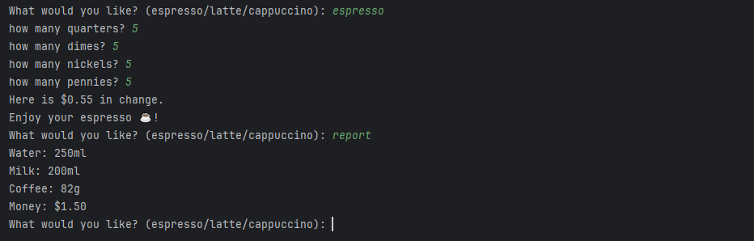

# Coffee Machine

## Table of contents
* [General info](#general-info)
* [Technologies](#technologies)
* [Setup](#setup)

## General info
Acts as a coffee vending machine. Allows user to select drink and input amount of change. Rejects coffee order if not enough coins entered, or returns amount of change owed. Can also print a report of the remaining ingredients in the machine.



Note: This project was created to learn Python. To improve on the code, I would create classes to manage the money, ingredients, machine, etc.

## Technologies
Project is created with:
* Python: 3.12
	
## Setup
To run this project, find the local directory in terminal and use the python script_name.py command:
```
$ cd ../CoffeeMachine
$ python main.py
```