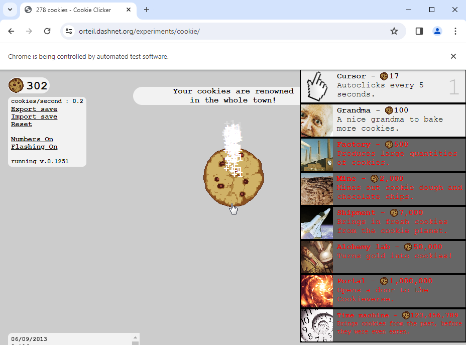

# Cookie Clicker

## Table of contents
* [General info](#general-info)
* [Technologies](#technologies)
* [Setup](#setup)

## General info
Automatically plays Cookie Clicker game. Clicks cookie every second, and every five sceonds purchases the most expensive upgrade that the player can afford.



## Technologies
Project is created with:
* Python: 3.12
* Libraries: Selenium
	
## Setup
To run this project, find the local directory in terminal and use the python script_name.py command:
```
$ cd ../CookieClicker
$ python main.py
```