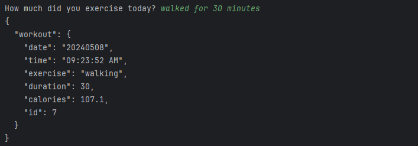
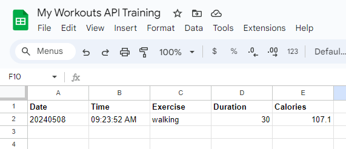

# Exercise Tracker

## Table of contents
* [General info](#general-info)
* [Technologies](#technologies)
* [Setup](#setup)

## General info
Asks user for the exercise they performed. Obtains query data from Nutrionix API. Then posts Nutrionix data into Google Sheet.

Interaction with the program:


The data posted into the GSheet:


	
## Technologies
Project is created with:
* Python: 3.12
* Libraries: Requests
	
## Setup
To run this project, find the local directory in terminal and use the python script_name.py command:
```
$ cd ../Billboard100
$ python main.py
```

Note that the user must have their environment variables configured (Client ID and Client Key for exercise endpoint, Bearer token for Sheety API).