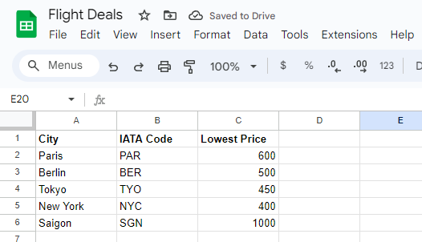

# Flight Deals Tracker

## Table of contents
* [General info](#general-info)
* [Technologies](#technologies)
* [Setup](#setup)

## General info
Program that gets user provided destination and maximum price data using Sheety API. Uses the provided information to get flight data using Tequila by Kiwi API. If a flight is found given the parameters, sends a text via Twilio API. 

GSheet with destinations and maximum flight prices:



Text notification:


	
## Technologies
Project is created with:
* Python: 3.12
* Libraries: Requests, Twilio
	
## Setup
To run this project, find the local directory in terminal and use the python script_name.py command:
```
$ cd ../FlightDeals
$ python main.py
```
Note: the user must set up their environment variables prior to running the program (Client ID and Client Password for Sheety, Tequila API Key, and SID and Auth Token for Twilio).

The program can be configured to be run daily using a service like PythonAnywhere.