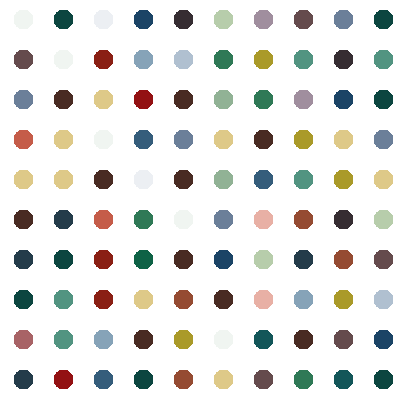

# Hirst Painting

## Table of contents
* [General info](#general-info)
* [Technologies](#technologies)
* [Setup](#setup)

## General info
Program that creates a Hirst painting dupe. It can be modified to use colors of your choice.

Example of a Hirst:


My version:




## Technologies
Project is created with:
* Python: 3.12
* Libraries: Turtle
	
## Setup
To run this project, find the local directory in terminal and use the python script_name.py command:
```
$ cd ../HirstPainting
$ python main.py
```