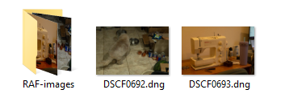

# Image File Organizer

## Table of contents
* [General info](#general-info)
* [Technologies](#technologies)
* [Setup](#setup)

## General info
Program that obtains the file extension and moves all .RAF files into a separate folder.


	
## Technologies
Project is created with:
* Python: 3.12
* Libraries: Requests, Twilio
	
## Setup
To run this project, find the local directory in terminal and use the python script_name.py command:
```
$ cd ../ImageFileOrganizer
$ python main.py
```
The user must provide the directory of the folder that they want organized prior to running the script.