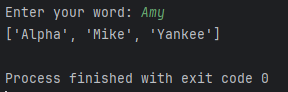

# NATO

## Table of contents
* [General info](#general-info)
* [Technologies](#technologies)
* [Setup](#setup)

## General info
Asks for input from the user which must only contain alpha values. Returns the word in the NATO alphabet formatted in a list.


	
## Technologies
Project is created with:
* Python: 3.12
* Libraries: Pandas
	
## Setup
To run this project, find the local directory in terminal and use the python script_name.py command:
```
$ cd ../NATO
$ python main.py
```