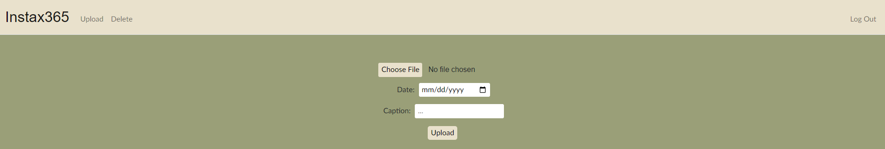
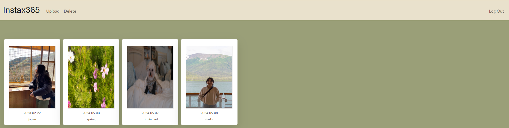

# Project 365

## Table of contents
* [General info](#general-info)
* [Technologies](#technologies)
* [Setup](#setup)

## General info
This is a web application that allows users to create and manage their own profile. They can then add photos to their portfolio - only one photo can be associated with each day. It acts like a Project 365 portfolio. Users' portfolio data are stored in a SQL database and is reloaded when they log in. Photos can also be deleted from the portfolio if the user wishes.

Registration page:



My portfolio:


	
## Technologies
Project is created with:
* Python: 3.12
* Libraries: Flask, SQL
	
## Setup
To run this project, find the local directory in terminal and use the python script_name.py command:
```
$ cd ../Project365
$ python app.py
```
Note: this website is currently only run locally on my computer. I would love to host it if there were a free option.