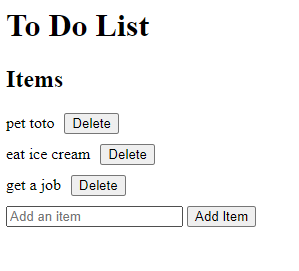

# To Do List

## Table of contents
* [General info](#general-info)
* [Technologies](#technologies)
* [Setup](#setup)

## General info
Program that saves a to do list and allows user to add and delete items. Items are stored in local storage and reload when the page is refreshed.

	
## Technologies
Project is created with:
* Node v22.1.0
* HTML
	
## Setup
To run this project, open the folder in VS Code. Then open the html file with Live Server.