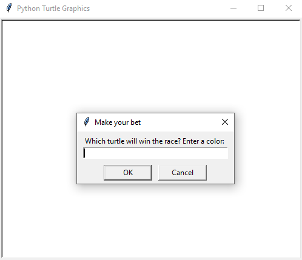

# Turtle Race

## Table of contents
* [General info](#general-info)
* [Technologies](#technologies)
* [Setup](#setup)

## General info
Bet on which turtle will win the race. Turtles move to the right of the screen in random increments. First turtle to the right edge of the screen is the winner.

Betting on which turtle will win:



The race:


	
## Technologies
Project is created with:
* Python: 3.12
* Libraries: Turtle
	
## Setup
To run this project, find the local directory in terminal and use the python script_name.py command:
```
$ cd ../TurtleRace
$ python main.py
```