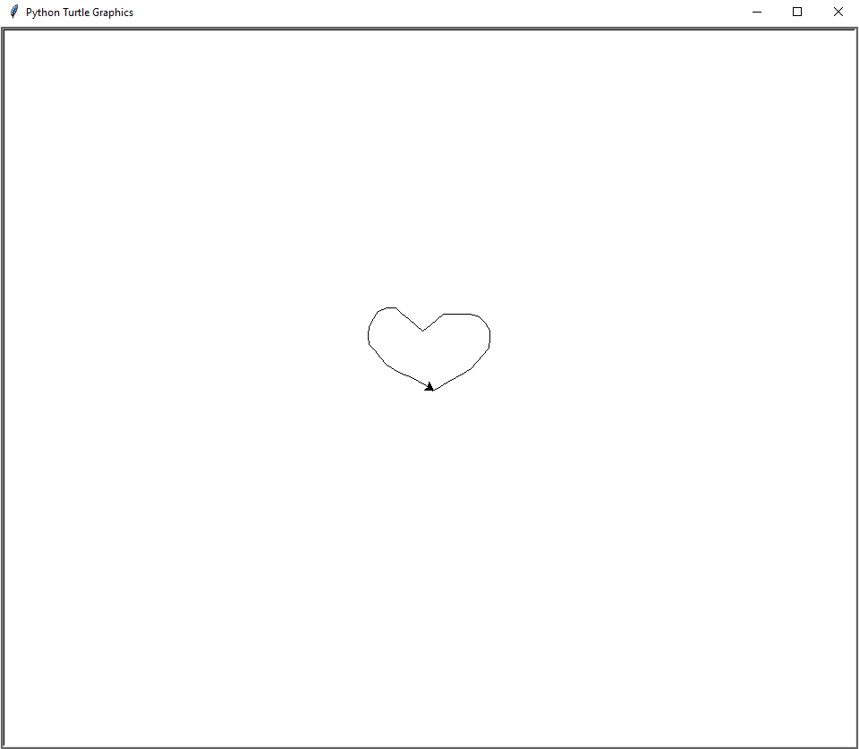

# Etch-a-sketch

## Table of contents
* [General info](#general-info)
* [Technologies](#technologies)
* [Setup](#setup)

## General info
Allows user to control and draw used WASD controls.



	
## Technologies
Project is created with:
* Python: 3.12
* Libraries: Turtle
	
## Setup
To run this project, find the local directory in terminal and use the python script_name.py command:
```
$ cd ../etch-a-sketch
$ python main.py
```