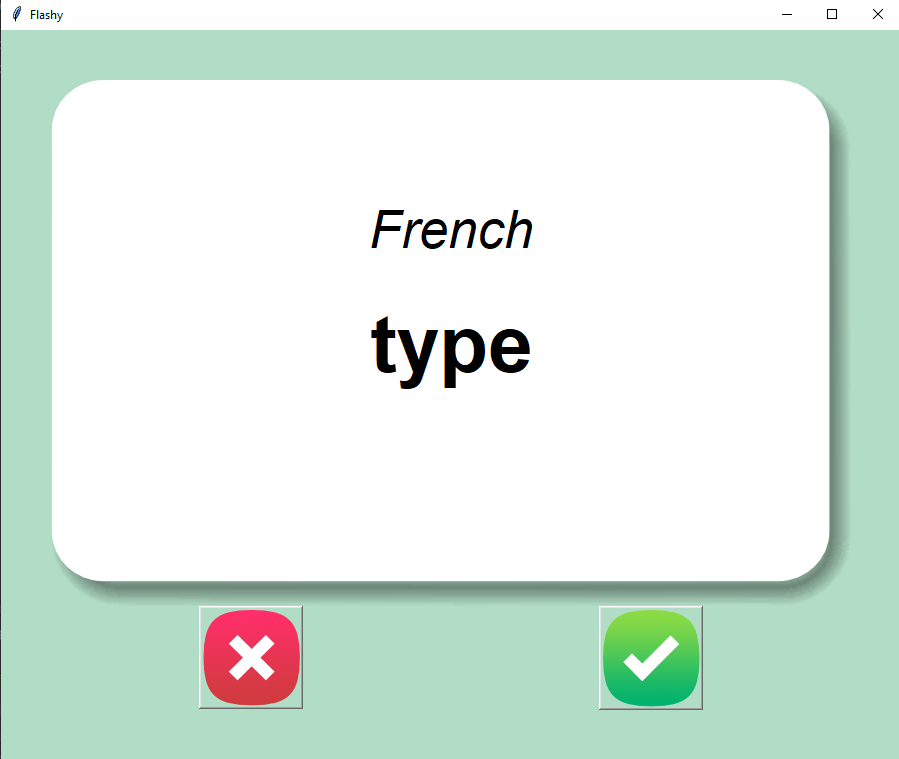
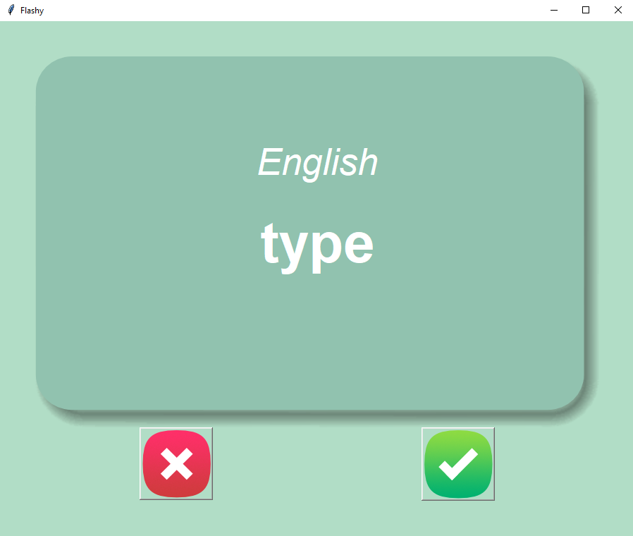

# Flashcards

## Table of contents
* [General info](#general-info)
* [Technologies](#technologies)
* [Setup](#setup)

## General info
Flashcard app to learn vocabulary or concepts. After 3 seconds, card automatically flips to the back. User must then select check mark if information was known or X if not known. Words that are known are removed from the csv file and are not included in the next run.

Front of card:


Back of card:


	
## Technologies
Project is created with:
* Python: 3.12
* Libraries: TKinter, Pandas
	
## Setup
To run this project, find the local directory in terminal and use the python script_name.py command:
```
$ cd ../flashcards
$ python main.py
```