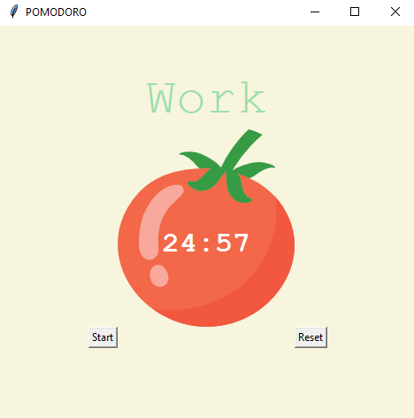

# Pomodoro

## Table of contents
* [General info](#general-info)
* [Technologies](#technologies)
* [Setup](#setup)

## General info
Pomodoro timer for studying. Work sessions are 25 minutes followed by a five minutes break. After four consecutive rounds, a long break of 15 minutes is awarded.


	
## Technologies
Project is created with:
* Python: 3.12
* Libraries: Tkinter
	
## Setup
To run this project, find the local directory in terminal and use the python script_name.py command:
```
$ cd ../pomodoro
$ python main.py
```