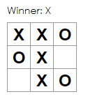

# To Do List

## Table of contents
* [General info](#general-info)
* [Technologies](#technologies)
* [Setup](#setup)

## General info
Tic-tac-toe game that keeps track of player turn and prints out winner.


	
## Technologies
Project is created with:
* Node v22.1.0
* React 18.3.1
* CSS
	
## Setup
To run this project, find the local directory in terminal and use the node start command:
```
npm start
```